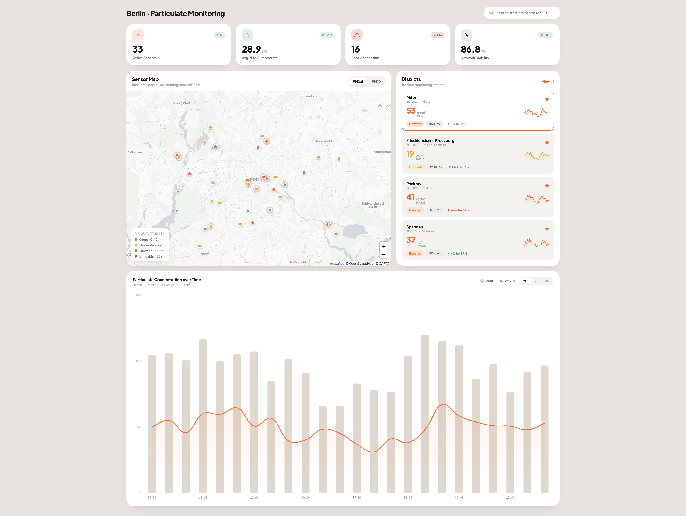

# Air Quality Monitoring Dashboard

**Frontend Home Assignment**

Build a single-screen desktop dashboard for a network of low-cost particulate
sensors (PM2.5 / PM10) deployed across Berlin. Each section below describes the
purpose and expected features of one UI component.

## Constraints

The following technologies are required. Any additional libraries are at your
discretion.

| Technology         | Purpose                                              |
| ------------------ | ---------------------------------------------------- |
| **Vite + Vue 3**   | Build tooling and framework.                         |
| **PrimeVue**       | UI component library.                                |
| **OpenStreetMap**  | Map tiles, via Leaflet or an equivalent Vue wrapper. |
| **Chart library**  | Your choice (e.g. Chart.js, Apache ECharts, ApexCharts). |

All shared UI elements (buttons, inputs, cards, badges, etc.) must be implemented
as dedicated project-level components sitting on top of PrimeVue primitives. Any
design change to a shared element should propagate across the entire interface
from a single edit point, with no need to touch individual views.

## 1 · Overview

Reference view of the full application. Shows all five sections in context:
header, KPI row, map + district list panel, and the full-width chart below.

## 2 · Header

Persistent top bar for navigation and station lookup. Page title on the left;
search field on the right for lookup by district name or sensor ID.

## 3 · KPI Tiles

Four summary cards giving an immediate read on network state: Active Sensors,
Avg PM2.5, Poor Connection, Network Stability.

## 4 · Sensor Map

Geographic overview of the sensor network. One marker per station, colour-coded
by AQI (green through red). Includes a PM2.5 / PM10 pollutant toggle; selecting a
marker updates the chart below.

The Air Quality Index legend:

- **Good** · 0–12
- **Moderate** · 12–35
- **Elevated** · 35–55
- **Unhealthy** · 55+

## 5 · Districts

Watchlist of tracked stations. Each row shows: district, sensor ID and location,
live PM2.5 with AQI badge, 24-hour sparkline, PM10 value, connection quality and
stability %. Clicking a row loads the station into the chart.

## 6 · Particulate Concentration Chart

Full-width time-series chart for the selected station. PM10 rendered as bars,
PM2.5 as an overlaid line, on a shared time axis. Range selector: 24H / 7D / 30D.
